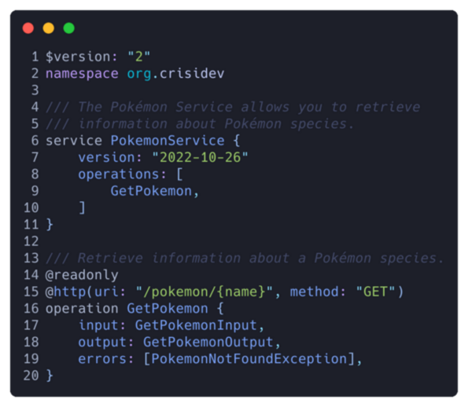

# **Modelling a Pokèmon API with Smithy and 🦀**

Matteo Bigoi

Rust Meetup October 2022

---

## Matteo Bigoi


- 🧑 Software Enginner in AWS
- 💻 [crisidev](https://github.com/crisidev)
- 💬 [@crisidev](https://twitter.com/crisidev)

---


## Topics

* The Smithy IDL
* Smithy-rs
* Code generation
* Pokémon
* Service implementation
* Demo

---

## Smithy IDL

Smithy is a language for defining services and SDKs.



---


## Smithy-rs

- Generate SDKs and services in Rust
- Code-generation + runtime components
- Extensible, built on top of [Tower](https://tower.rs)
- Reliable, built on top of [Tokio](http://tokio.rs) and [Hyper](https://hyper.rs)
- Focus on the API business logic

---

## Smithy-rs


- Multiple protocols support
    - 2 RPC and 1 REST over JSON
    - More to come 🎉
- Input validation
- Sensitive fields
- Tower middleware
- Instrumentation
- Run in lambda

---

## Pokemon service


API to retrieve information about Pokémon

```bash
GET /pokemon-species/{pokemon-name}
```

```json
{
    "flavorTextEntries": [
        "flavorText": "Pokémon description",
        "language": "en"
    ]
    "name": "Pokémon name"
}
```
---


<!-- _color: black -->
# The Smithy model

---


---


---


---

## Code generation

Generate the server and client SDK crates:

```bash
❯❯❯ ./gradlew assemble
```

- Input / Output / Error data types
- Serialization / deserialization support
- Service builder
- Tower middlewares
- Instrumentation

---

## Service implementation


---

## Run with Hyper


---

## Handlers state


```rust
   Extension<Arc<State>>
```

- Supports arbitrary structures
- Concurrency is up to the developer
- Initialized once before startup
- Shared between handlers
- Tower middleware
- Opt-in

---


<!-- _color: black -->
## Demo

---


<!-- _color: white -->

# Start the service

```bash
❯❯❯ RUST_LOG=aws_smithy_http_server=debug,pokemon_service=debug pokemon-service
```

---

## Call the service

```bash
❯❯❯ curl -k -H "Accept: application/json" https://localhost:13734/pokemon-species/pikachu |jq
```

```json
{
  "flavorTextEntries": [
    {
      "flavorText": "When several of these Pokémon gather, their electricity could build and cause lightning storms.",
      "language": "en"
    },
    {
      "flavorText": "Quando vari Pokémon di questo tipo si radunano, la loro energia può causare forti tempeste.",
      "language": "it"
    },
    {
      "flavorText": "Cuando varios de estos Pokémon se juntan, su energía puede causar fuertes tormentas.",
      "language": "es"
    },
    {
      "flavorText": "ほっぺたの りょうがわに ちいさい でんきぶくろを もつ。ピンチのときに ほうでんする。",
      "language": "jp"
    }
  ],
  "name": "pikachu"
}
```

---

## Service tracing

```bash
2022-10-25T08:20:32.313991Z DEBUG request{
    operation=org.crisidev#GetPokemonSpecies
    method=GET
    uri=https://localhost:13734/pokemon-species/pikachu
    headers={"user-agent": "curl/7.68.0", "accept": "application/json"}
}: pokemon_service: 37: Requested Pokémon is pikachu

2022-10-25T08:20:32.314102Z  INFO request{
    operation=org.crisidev#GetPokemonSpecies
    method=GET
    uri=https://localhost:13734/pokemon-species/pikachu
    headers={"user-agent": "curl/7.68.0", "accept": "application/json"}
}: pokemon_service: 41: Found Pokémon specie pikachu

2022-10-25T08:20:32.314313Z DEBUG request{
    operation=org.crisidev#GetPokemonSpecies
    method=GET
    uri=https://localhost:13734/pokemon-species/pikachu
    headers={"user-agent": "curl/7.68.0", "accept": "application/json"}
}: aws_smithy_http_server::instrumentation::service: 47: response
    headers={"content-type": "application/json", "content-length": "573"}
    status_code=200 OK
```

---


## Bonus

- Write your business logic in Python
- Powered by Rust and [PyO3](https://pyo3.rs)
- Pure Python middlewares
- Asyncio support
- Run un AWS Lambda
- 🚀 Fast! 🚀

---

## 🐍🐍🐍🐍🐍


---

## I want to use this!

##### https://github.com/crisidev/smithy-rs-pokemon-service

```bash
❯❯❯ git clone https://github.com/crisidev/smithy-rs-pokemon-service
❯❯❯ ./smithy-rs-pokemon-service/docs/template/new.sh my-service /tmp/my-service
❯❯❯ cd /tmp/my-service && cargo build
```

- Simple repo showing the Pokémon service
- Scripts to build a new project from templates
    - Handles Gradle
    - Handles smithy-rs dependencies


---

# Questions?

---

## Documentation

#### Examples
- [crisidev/smithy-rs-pokemon-service](https://github.com/crisidev/smithy-rs-pokemon-service)
- [awslabs/smithy-rs Rust example](https://github.com/awslabs/smithy-rs/blob/main/rust-runtime/aws-smithy-http-server/examples/README.md)
- [awslabs/smithy-rs Python example](https://github.com/awslabs/smithy-rs/blob/main/rust-runtime/aws-smithy-http-server-python/examples/README.md)

---

## Documentation

#### Design
- [Smithy IDL specification](https://awslabs.github.io/smithy/2.0/)
- [Smithy-rs code generation](https://awslabs.github.io/smithy-rs/design/server/code_generation.html)
- [Smithy-rs instrumentation](https://awslabs.github.io/smithy-rs/design/server/instrumentation.html)
- [Smithy-rs Pokémon service example](https://awslabs.github.io/smithy-rs/design/server/pokemon_service.html)

